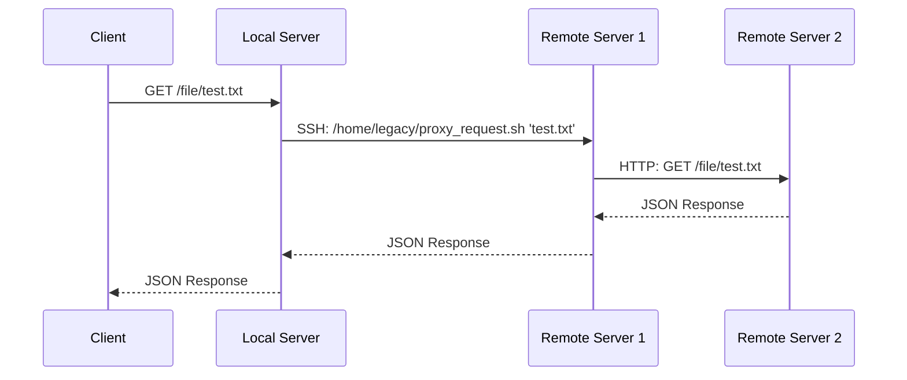

# Setup 
git clone

cd takeHomeInterview

./scripts/generate_keys.sh

docker compose build

docker compose up -d

You can either test with ./scripts/test.sh or curl http://localhost:5001/file/test.txt 

# System Stability Legacy Bridge

A distributed file transfer system that demonstrates enterprise integration patterns for legacy government and mainframe environments.

## Overview

This project implements a three-tier system where a modern Local Server must retrieve files from a Windows Remote Server through a constrained legacy intermediary, simulating real-world enterprise and government system integration challenges.

### Architecture
After a good bit of thought I decided that what made the most sense to me was to use techs I was most comfortable with inside of the constraints. I wanted to simulate the real world separate physical systems so I decided docker would work for this portion. I also kind of assumed I could create a windows image before running into the whole mac silicon incompatibility with windows images issues. There was a point where I considered remote server 2 should use an ec2 to simulate that environment but I decided against it for simplicity's sake and that I could effectively mock the differences in return for remote server 1 to parse.
I already had experience with paramiko and ssh as well as error handling since I assumed I might have some issues with setup. The paramiko library felt like the right choice because it gave me programmatic control over SSH connections, which I knew I'd need for the API-style requests coming from the local server. Having dealt with subprocess SSH calls before, I knew that approach would be more fragile and harder to debug when things inevitably went wrong.
For remote server 1 I went down a few rabbit holes of something simple with cobol or c but decided on simple shell script since I wanted to get something working and both of those left me in compilation hell. The COBOL route seemed authentic but would have required setting up a compiler environment, and frankly, I didn't want to spend half my time fighting with 40-year-old toolchains. The C approach would have been more performant, but again, cross-compilation and dependency management felt like it would eat up time I wanted to spend on the actual problem.
I did some research on which tech would be available to legacy systems and fell on netcat. It turned out to be perfect because it's basically been around forever, it's on every Unix system, and it's exactly the kind of "bare metal" tool you'd find in a government environment where they can't install modern software. Plus, it let me build raw HTTP requests, which felt more authentic to the constraint than trying to use wget or curl.
The shell script approach also meant I could iterate quickly - no compilation step, just edit the script and test. When I ran into issues with JSON parsing using just basic Unix tools, I could experiment with different combinations of sed, awk, and tr until I found something that worked reliably.
Looking back, the biggest technical decision was probably choosing to handle the Windows compatibility at the HTTP protocol level rather than trying to actually run Windows containers locally. Once I realized Docker Desktop on Mac couldn't run Windows containers, I could have pivoted to a cloud solution, but I decided it was more important to demonstrate the integration patterns than to get hung up on the actual OS differences. The HTTP layer abstraction ended up being cleaner anyway - it shows how you'd actually bridge different platforms in a real enterprise environment. I wanted to mostly simulate something as a proof of concept. I think I represented the differences in returns that you might see when using windows. I also made the decision to not add any api framework and just make this as simple as possible as its only purpose was to serve files from the system.
The error handling strategy took some thinking too. I knew from experience that distributed systems fail in creative ways, so I made sure every layer could return the same JSON error format. That way, whether the SSH connection failed, the shell script crashed, or the HTTP request timed out, the client would always get a consistent response format. It's the kind of defensive programming you need when you're dealing with legacy systems that might behave unpredictably.


## Notes 

Researched what tools would actually be available on 1980s Unix systems.

Found that netcat (nc) has been around since 1995 and is considered a "basic" tool.

Key insight: netcat is just raw TCP - I need to build HTTP requests manually!

First working attempt:

echo "GET /file/$1 HTTP/1.0" | nc remote-server-2 8080

Issues:

- Missing HTTP headers
  
- Response includes headers I don't want

  
- No proper line endings


Getting the full HTTP response but need to extract just the JSON part:

```
HTTP/1.0 200 OK
Server: BaseHTTP/0.6 Python/3.11.13
Date: Mon, 23 Jun 2025 18:53:23 GMT
Content-Type: application/json
Content-Length: 101
Connection: close

{
  "status": "success",
  "data": "Test file content",
  "msg": "data returned"
}
```

Tried multiple approaches:

First try: grep

```
grep for lines with { and }
echo "$response" | grep "{"
# Problem: Only gets first line of JSON
```

After some research: sed to find block
```
sed to find JSON block  
echo "$response" | sed -n '/^{/,/^}/p'
# Better! Gets multi-line JSON
```

Oh shit windows might be different: Handle Windows line endings
```
echo "$response" | sed -n '/^{/,/^}/p' | tr -d '\r'
```


stdrr interferes with json output....


## Data Flow


## Optimizations

Connection Pooling: Could implement SSH connection reuse

Async Processing: Background job submission with polling

Caching: File metadata caching on legacy server

Load Balancing: Multiple legacy server instances

Certificate Management: Proper SSH certificate rotation

## AI assist
### Question 
Help me understand why a government system would need a legacy bridge. In my scenario I am communicating from local server with a file name to remote server 1 over tcp remote server 1 is any communication to remote server 2 which stores the files. remote server 2 passes them back to remote server 1 which extracts and than returns to local server

### Answer
Government Legacy Bridge Need

Why bridges exist:

Air-gapped security - Legacy systems can't touch the internet
Cannot be replaced - Too risky/expensive to modernize 40-year-old systems
Protocol differences - Modern APIs vs. legacy interfaces
Compliance - All access must be logged and controlled

Real Examples

IRS: Modern tax software → Gateway → 1960s tax calculation mainframe
Social Security: Online portal → Bridge → COBOL benefit calculation system
VA: Veterans website → Gateway → Disability benefits database

Your Architecture in Practice
Citizen Web Portal → SSH Gateway → Mainframe File System
(Modern React)      (Shell scripts)  (40-year-old COBOL)
Key insight: The "bridge" (your Remote Server 1) exists because:

Legacy systems can't be modified
Modern systems need the data
Security requires isolation
Government can't risk breaking critical systems

Your scenario perfectly represents how government agencies provide modern digital services while protecting legacy infrastructure that processes trillions in benefits, taxes, and critical operations.

## Question 

Give me a shell scripting cheat sheet including netcat

## Answer 

# Shell Scripting & Netcat Cheat Sheet

## **Basic Shell Scripting (POSIX sh)**

### **Script Structure**
```bash
#!/bin/sh                    # POSIX shell (maximum compatibility)
set -e                       # Exit on any error (optional)
set -u                       # Exit on undefined variables (optional)
```

### **Variables**
```bash
name="value"                 # No spaces around =
echo "$name"                 # Use quotes to prevent word splitting
echo "${name}_suffix"        # Braces for variable expansion
readonly name="constant"     # Make variable read-only
unset name                   # Remove variable
```

### **Command Line Arguments**
```bash
first_arg="$1"               # First argument
script_name="$0"             # Script name
arg_count="$#"               # Number of arguments
all_args="$@"                # All arguments as separate words
all_args_string="$*"         # All arguments as single string
```

### **Conditionals**
```bash
if [ condition ]; then
    echo "true case"
elif [ other_condition ]; then
    echo "else if case"
else
    echo "false case"
fi

# Common test operators
[ -f file ]        # File exists and is regular file
[ -d dir ]         # Directory exists
[ -e path ]        # Path exists (file or directory)
[ -r file ]        # File is readable
[ -w file ]        # File is writable
[ -x file ]        # File is executable
[ -s file ]        # File exists and is not empty
[ -z "$var" ]      # String is empty
[ -n "$var" ]      # String is not empty
[ "$a" = "$b" ]    # Strings equal
[ "$a" != "$b" ]   # Strings not equal
[ "$a" -eq "$b" ]  # Numbers equal
[ "$a" -ne "$b" ]  # Numbers not equal
[ "$a" -lt "$b" ]  # Less than
[ "$a" -gt "$b" ]  # Greater than
```

### **Loops**
```bash
# For loop
for item in list1 list2 list3; do
    echo "$item"
done

# For loop with command substitution
for file in $(ls *.txt); do
    echo "Processing $file"
done

# While loop
while [ condition ]; do
    echo "looping"
done

# Read file line by line
while IFS= read -r line; do
    echo "Line: $line"
done < filename
```

### **Functions**
```bash
my_function() {
    local var="$1"           # Local variable
    echo "Function called with: $var"
    return 0                 # Return exit code
}

# Call function
my_function "argument"
```

### **Exit Codes & Error Handling**
```bash
exit 0              # Success
exit 1              # General error
exit 2              # Misuse of shell command
result=$?           # Capture exit code of last command

# Check command success
if command_name; then
    echo "Success"
else
    echo "Failed with code $?"
fi
```

## **Input/Output & Redirection**

### **Output Redirection**
```bash
echo "message" >&2           # Send to stderr
echo "data" > file           # Overwrite file
echo "data" >> file          # Append to file
command > output 2>&1        # Redirect both stdout and stderr
command 2>/dev/null          # Suppress error output
command >/dev/null 2>&1      # Suppress all output
```

### **Input Redirection**
```bash
command < inputfile          # Read from file
command << 'EOF'             # Here document
line 1
line 2
EOF
```

### **Pipes**
```bash
command1 | command2          # Pipe output to input
command1 | command2 | command3  # Chain multiple commands
```

## **Text Processing Tools**

### **printf (Preferred over echo)**
```bash
printf "Hello %s\n" "World"
printf "Number: %d\n" 42
printf "Float: %.2f\n" 3.14159
printf "Hex: %x\n" 255
printf "No newline"          # No automatic newline
```

### **sed (Stream Editor)**
```bash
# Substitution
sed 's/old/new/'             # Replace first occurrence per line
sed 's/old/new/g'            # Replace all occurrences
sed 's/old/new/2'            # Replace second occurrence per line

# Line operations
sed -n '5p'                  # Print line 5 only
sed -n '5,10p'               # Print lines 5-10
sed '5d'                     # Delete line 5
sed '/pattern/d'             # Delete lines matching pattern

# Pattern ranges
sed -n '/start/,/end/p'      # Print from start pattern to end pattern
sed '/start/,/end/d'         # Delete from start pattern to end pattern

# Multiple commands
sed -e 's/old/new/g' -e '/pattern/d'
```

### **awk (Text Processing)**
```bash
# Basic usage
awk '{print $1}'             # Print first field
awk '{print $NF}'            # Print last field
awk '{print NR, $0}'         # Print line number and line

# Field separator
awk -F: '{print $2}'         # Use colon as separator
awk -F'[ \t]+' '{print $1}'  # Multiple separators

# Pattern matching
awk '/pattern/ {print}'      # Print lines matching pattern
awk '$1 == "value" {print}'  # Print if first field equals value

# Built-in variables
awk '{print NR}'             # Line number
awk '{print NF}'             # Number of fields
awk '{print length}'         # Length of current line
```

### **grep (Pattern Matching)**
```bash
grep "pattern" file          # Find lines containing pattern
grep -v "pattern" file       # Lines NOT containing pattern
grep -i "pattern" file       # Case insensitive
grep -n "pattern" file       # Show line numbers
grep -c "pattern" file       # Count matches
grep -o "pattern" file       # Show only matching part
grep -r "pattern" dir/       # Recursive search
grep -E "regex" file         # Extended regex
```

### **tr (Character Translation)**
```bash
tr 'a-z' 'A-Z'              # Convert to uppercase
tr 'A-Z' 'a-z'              # Convert to lowercase
tr -d 'chars'               # Delete specified characters
tr -d '\r'                  # Delete carriage returns
tr -d '\n'                  # Delete newlines
tr -s ' '                   # Squeeze multiple spaces to one
tr ' ' '_'                  # Replace spaces with underscores
```

### **cut (Extract Fields)**
```bash
cut -d: -f1                 # First field, colon-delimited
cut -d: -f1,3               # Fields 1 and 3
cut -c1-10                  # Characters 1-10
cut -c1,5,10                # Characters 1, 5, and 10
```

### **sort & uniq**
```bash
sort file                   # Sort alphabetically
sort -n file                # Sort numerically
sort -r file                # Reverse sort
sort -k2 file               # Sort by second field
uniq file                   # Remove duplicate adjacent lines
sort file | uniq            # Remove all duplicates
sort file | uniq -c         # Count occurrences
```

## **Netcat (Network Swiss Army Knife)**

### **Basic TCP Client**
```bash
nc hostname port            # Connect to host on port
nc -v hostname port         # Verbose connection
nc -w timeout hostname port # Connection timeout
nc -z hostname port         # Port scan (check if open)
```

### **Sending Data**
```bash
echo "data" | nc host port  # Send simple data
nc host port < file         # Send file contents
printf "formatted data" | nc host port
```

### **Server Mode**
```bash
nc -l port                  # Listen on port
nc -l -p port               # Listen on specific port (some versions)
nc -l port < file           # Serve file contents
```

### **Advanced Options**
```bash
nc -u host port             # UDP instead of TCP
nc -n host port             # Don't resolve hostnames
nc -4 host port             # Force IPv4
nc -6 host port             # Force IPv6
```

### **HTTP with Netcat**
```bash
# Basic HTTP request structure
printf "GET /path HTTP/1.1\r\nHost: hostname\r\nConnection: close\r\n\r\n" | nc hostname 80

# HTTP with headers
printf "GET /api/data HTTP/1.1\r\nHost: api.example.com\r\nUser-Agent: MyClient/1.0\r\nAccept: application/json\r\nConnection: close\r\n\r\n" | nc api.example.com 80
```

### **Testing Connectivity**
```bash
# Port availability check
if nc -z hostname port; then
    echo "Port is open"
else
    echo "Port is closed"
fi

# Timeout check
if nc -w 5 hostname port < /dev/null; then
    echo "Connection successful"
else
    echo "Connection failed"
fi
```

## **String Operations**

### **String Length & Substrings**
```bash
string="hello world"
echo ${#string}             # String length
echo ${string#prefix}       # Remove shortest prefix match
echo ${string##prefix}      # Remove longest prefix match
echo ${string%suffix}       # Remove shortest suffix match
echo ${string%%suffix}      # Remove longest suffix match
echo ${string:2:5}          # Substring: start at 2, length 5
```

### **String Tests**
```bash
# Check if string contains substring
case "$string" in
    *substring*) echo "Contains substring" ;;
    *) echo "Does not contain" ;;
esac

# Pattern matching
case "$filename" in
    *.txt) echo "Text file" ;;
    *.log) echo "Log file" ;;
    *) echo "Other file" ;;
esac
```

## **File Operations**

### **File Tests**
```bash
if [ -f "$file" ]; then echo "Regular file"; fi
if [ -d "$dir" ]; then echo "Directory"; fi
if [ -L "$link" ]; then echo "Symbolic link"; fi
if [ -e "$path" ]; then echo "Exists"; fi
if [ -s "$file" ]; then echo "Not empty"; fi
if [ -r "$file" ]; then echo "Readable"; fi
if [ -w "$file" ]; then echo "Writable"; fi
if [ -x "$file" ]; then echo "Executable"; fi
```

### **Temporary Files**
```bash
tmpfile="/tmp/script.$$"    # Use process ID for uniqueness
tmpfile=$(mktemp)           # Create secure temp file
tmpdir=$(mktemp -d)         # Create temp directory

# Always clean up
trap 'rm -f "$tmpfile"' EXIT
```

## **Error Handling Patterns**

### **Defensive Programming**
```bash
# Check prerequisites
command -v required_tool >/dev/null 2>&1 || {
    echo "Error: required_tool not found" >&2
    exit 1
}

# Validate inputs
if [ $# -lt 1 ]; then
    echo "Usage: $0 <argument>" >&2
    exit 1
fi

# Set default values
config_file="${CONFIG_FILE:-/etc/default.conf}"
timeout="${TIMEOUT:-30}"
```

### **Trap for Cleanup**
```bash
cleanup() {
    rm -f "$tmpfile"
    echo "Cleanup completed" >&2
}

trap cleanup EXIT           # Run cleanup on exit
trap 'echo "Interrupted" >&2; exit 130' INT  # Handle Ctrl+C
```

## **Debugging Techniques**

### **Debug Output**
```bash
set -x                      # Show commands before execution
set +x                      # Turn off command tracing

# Manual debug output
debug() {
    echo "DEBUG: $*" >&2
}

debug "Variable value: $var"
```

### **Testing & Validation**
```bash
# Dry run mode
if [ "$DRY_RUN" = "true" ]; then
    echo "Would execute: $command"
else
    $command
fi

# Verbose mode
if [ "$VERBOSE" = "true" ]; then
    echo "Processing $file" >&2
fi
```

## **Performance & Portability**

### **POSIX Compliance**
```bash
# Use POSIX features for maximum compatibility
[ "$a" = "$b" ]             # Not ==
command                     # Not which command
$(command)                  # Not `command`
```

### **Efficient Patterns**
```bash
# Avoid subshells when possible
while IFS= read -r line; do  # Better than: for line in $(cat file)
    process "$line"
done < file

# Use built-ins when available
case "$var" in pattern) ;;  # Better than: if echo "$var" | grep pattern
```

This cheat sheet provides the essential tools for building robust shell scripts that work with network protocols and text processing on any POSIX-compliant system!

## Question 

In our example of remote server 2 being windows based and returning files to remote server 1 for extraction help me understand some key differences Windows would give than linux in their responses

## Answer 

# Windows vs Linux HTTP Response Differences

## **HTTP Server Behavior Differences**

### **Server Headers**
```bash
# Linux Response (Apache/Nginx/Python)
HTTP/1.0 200 OK
Server: Apache/2.4.41 (Ubuntu)
Date: Mon, 23 Jun 2025 18:53:23 GMT
Content-Type: application/json
Connection: close

# Windows Response (IIS/.NET)
HTTP/1.1 200 OK
Server: Microsoft-IIS/10.0
Date: Mon, 23 Jun 2025 18:53:23 GMT
Content-Type: application/json; charset=utf-8
X-Powered-By: ASP.NET
X-AspNet-Version: 4.0.30319
Connection: close
```

**Key Differences:**
- **HTTP Version**: Windows often defaults to HTTP/1.1
- **Server Identity**: Reveals operating system and technology stack
- **Charset**: Windows explicitly includes charset in Content-Type
- **Framework Headers**: X-Powered-By, X-AspNet-Version common on Windows

## **Line Ending Differences (CRLF vs LF)**

### **The Cross-Platform Text Problem**
```bash
# Linux/Unix Response (LF only - \n)
HTTP/1.0 200 OK
Content-Type: application/json

{"status":"success","data":"content"}

# Windows Response (CRLF - \r\n)
HTTP/1.1 200 OK\r\n
Content-Type: application/json\r\n
\r\n
{"status":"success","data":"content"}\r\n
```

**Impact on Text Processing:**
```bash
# Without CRLF handling
grep "^{" response_file     # May not match due to \r

# With CRLF handling
tr -d '\r' < response_file | grep "^{"  # Removes carriage returns
```

## **Character Encoding & Byte Order Marks**

### **Default Encoding Behavior**
```bash
# Linux (UTF-8 default, no BOM)
Content-Type: application/json

# Windows (may include BOM)
Content-Type: application/json; charset=utf-8
# File might start with BOM: EF BB BF (UTF-8 signature)
```

**BOM Impact on Parsing:**
```bash
# File with BOM (common on Windows)
hexdump -C response_file
# Shows: ef bb bf 7b 22 73 74 61 74 75 73 22...
#        ^BOM^   { " s   t   a   t   u   s  "

# Can break pattern matching
sed -n '/^{/p' file         # Might not match due to BOM prefix
sed 's/^\xef\xbb\xbf//' file # Remove BOM first
```

## **File Path Representation**

### **Path Format Differences**
```json
// Linux Response
{
  "file_path": "/var/www/files/document.txt",
  "directory": "/var/www/files/"
}

// Windows Response  
{
  "file_path": "C:\\inetpub\\wwwroot\\files\\document.txt",
  "directory": "C:\\inetpub\\wwwroot\\files\\"
}
```

**JSON Escaping Requirements:**
- Windows paths require **double backslashes** in JSON
- Can cause parsing complexity in shell scripts
- Forward slashes may work in some Windows APIs, but not all

## **Error Message Formats**

### **System Error Responses**
```json
// Linux Error (minimal)
{
  "error": "File not found",
  "code": 404
}

// Windows Error (verbose)
{
  "error": "The system cannot find the file specified.",
  "code": 404,
  "system_error": "ERROR_FILE_NOT_FOUND",
  "win32_error": 2,
  "hresult": "0x80070002"
}
```

**Registry and Windows-Specific Errors:**
```json
{
  "error": "Access is denied.",
  "system_error": "ERROR_ACCESS_DENIED", 
  "details": "The requested operation requires elevation"
}
```

## **HTTP Connection Handling**

### **Network Stack Differences**
```bash
# Linux (efficient connection handling)
# Typically closes connections quickly
# Supports high concurrent connections

# Windows (different networking behavior)
# May hold connections open longer
# Different TCP window scaling
# Registry settings affect behavior
```

**Connection Timeout Behavior:**
```bash
# Linux servers
nc server 80  # Usually quick connection/close

# Windows servers  
nc -w 10 server 80  # May need explicit timeout
```

## **Case Sensitivity**

### **File System Behavior**
```bash
# Linux (case sensitive)
/files/Document.txt ≠ /files/document.txt  # Different files

# Windows (case insensitive by default)
C:\files\Document.txt = C:\files\document.txt  # Same file
```

**HTTP Request Impact:**
```bash
# Linux Web Server
GET /files/File.txt     # Must match exact case
GET /files/file.txt     # Different resource

# Windows Web Server (IIS)
GET /files/File.txt     # May return test.txt if it exists
GET /files/file.txt     # Same resource as above
```

## **Security Headers & Policies**

### **Default Security Posture**
```bash
# Linux Server (minimal default headers)
HTTP/1.1 200 OK
Server: nginx/1.18.0
Content-Type: application/json

# Windows Server (security-focused by default)
HTTP/1.1 200 OK
Server: Microsoft-IIS/10.0
X-Frame-Options: SAMEORIGIN
X-Content-Type-Options: nosniff
X-XSS-Protection: 1; mode=block
Referrer-Policy: strict-origin-when-cross-origin
```

## **File Metadata Differences**

### **File System Attributes**
```json
// Linux File Info
{
  "size": 1024,
  "modified": "2025-06-23T18:53:23Z",
  "permissions": "644",
  "owner": "www-data"
}

// Windows File Info
{
  "size": 1024,
  "modified": "2025-06-23T18:53:23.123Z",
  "created": "2025-06-20T10:30:00.000Z",
  "attributes": ["Archive", "ReadOnly"],
  "owner": "DOMAIN\\user"
}
```

## **Content-Type Handling**

### **MIME Type Differences**
```bash
# Linux (standard MIME types)
Content-Type: text/plain
Content-Type: application/json
Content-Type: text/html

# Windows (may include additional info)
Content-Type: text/plain; charset=utf-8
Content-Type: application/json; charset=utf-8
Content-Type: text/html; charset=utf-8; boundary=something
```

## **Shell Script Adaptation Strategies**

### **Cross-Platform Response Parsing**
```bash
# Robust HTTP response processing
parse_response() {
    local response="$1"
    
    # Remove potential BOM
    response=$(echo "$response" | sed 's/^\xef\xbb\xbf//')
    
    # Remove Windows line endings
    response=$(echo "$response" | tr -d '\r')
    
    # Extract content after headers
    echo "$response" | sed -n '/^$/,$p' | tail -n +2
}
```

### **Timeout Handling for Different Platforms**
```bash
# Conservative timeout for Windows servers
make_request() {
    local host="$1"
    local port="$2"
    
    printf "GET / HTTP/1.1\r\nHost: %s\r\nConnection: close\r\n\r\n" "$host" | \
    nc -w 15 "$host" "$port"  # Longer timeout for Windows
}
```

### **Path Normalization**
```bash
# Handle both Unix and Windows paths in responses
normalize_path() {
    local path="$1"
    
    # Convert backslashes to forward slashes
    echo "$path" | sed 's/\\\\/\//g'
}
```

## **Enterprise Integration Implications**

### **Why These Differences Matter**
1. **Legacy Systems**: Often mix Linux and Windows infrastructure
2. **Data Consistency**: Same data may be formatted differently
3. **Error Handling**: Windows provides more verbose error information
4. **Performance**: Different connection handling affects throughput
5. **Security**: Default security postures vary significantly

### **Common Enterprise Patterns**
```bash
# Gateway/Proxy Pattern Benefits:
Windows Server → Gateway → Normalized Response → Client
  (complex)      (adapter)    (clean/standard)    (simple)
```

**Advantages:**
- **Protocol Translation**: Handle platform-specific behaviors
- **Format Normalization**: Convert to standard formats
- **Error Standardization**: Consistent error responses
- **Performance Optimization**: Connection pooling, caching
- **Security Enforcement**: Consistent security headers

This is why enterprise architectures often use intermediate layers - they abstract away the messy reality of cross-platform differences while providing clean, consistent interfaces to consuming applications.
